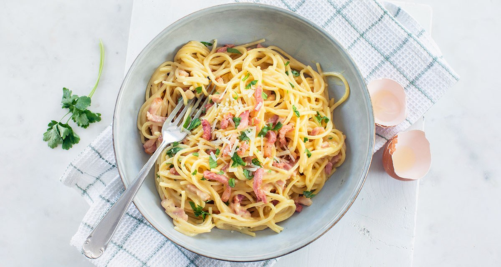

# Spaghetti Carbonara 🍝
 

 
## BENODIGDHEDEN
- 200g spaghetti
- 100g pancetta or guanciale
- 2 large eggs
- 50g grated pecorino cheese
- 50g grated Parmesan cheese
- 2 cloves garlic
- Salt and freshly ground black pepper
- Olive oil
 
### BEREIDING
1. Bring a large pot of salted water to a boil and cook the spaghetti until al dente.
2. Meanwhile, heat a bit of olive oil in a pan over medium heat and cook the pancetta until it’s crispy. Add the garlic and cook for another minute. Remove garlic after.
3. In a bowl, beat the eggs and mix in the grated cheeses, salt, and a generous amount of black pepper.
4. Drain the spaghetti, reserving some of the cooking water.
5. Add the hot pasta to the pan with pancetta and remove from heat.
6. Pour the egg and cheese mixture over the pasta, stirring quickly to create a creamy sauce. Add reserved pasta water if needed to adjust the consistency.
7. Serve immediately with extra grated cheese on top.
 
[Original Recipe](https://www.leukerecepten.nl/recepten/pasta-carbonara-recept/)
